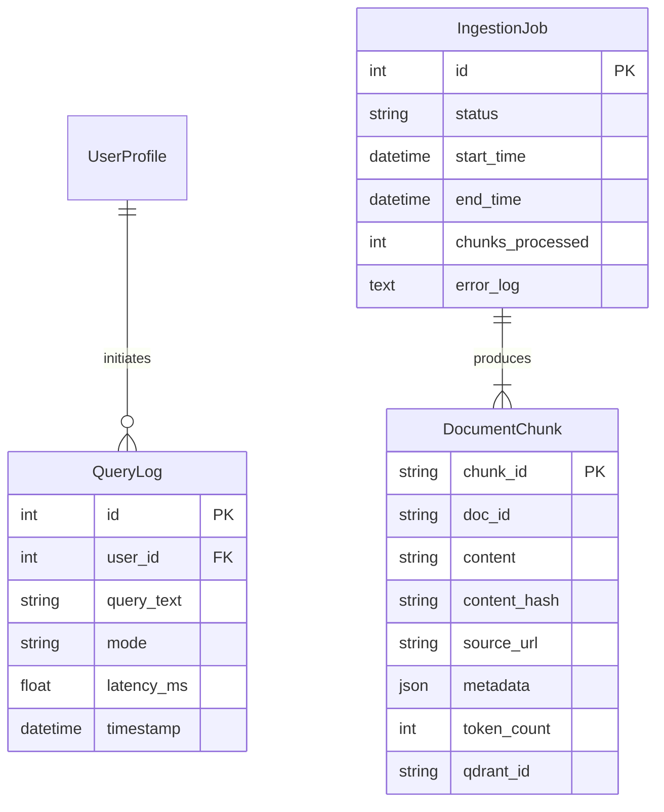

# Data Model: Integrated RAG Chatbot

## Entity-Relationship Diagram (Logical)



## Entities

### DocumentChunk
Represents a searchable segment of the book. Stored in **Qdrant** (vectors + payload) and mapped in **Neon** (SQL).

| Field | Type | Description |
|-------|------|-------------|
| `chunk_id` | UUID | Unique identifier for the chunk. |
| `doc_id` | String | Logical ID of the source document (e.g., `module-1/intro`). |
| `content` | Text | The actual text content of the chunk. |
| `content_hash` | String | SHA-256 hash of content for deduplication. |
| `source_url` | String | URL path to the section in the published book. |
| `metadata` | JSON | Structured context: `{ "chapter": "...", "section": "..." }`. |
| `token_count` | Integer | Length of the chunk in tokens. |
| `qdrant_id` | UUID | Corresponding Point ID in Qdrant. |

### IngestionJob
Tracks the status and outcome of background ingestion processes. Stored in **Neon**.

| Field | Type | Description |
|-------|------|-------------|
| `id` | Integer | Auto-increment primary key. |
| `status` | String | `pending`, `processing`, `completed`, `failed`. |
| `start_time` | DateTime | When the job started. |
| `end_time` | DateTime | When the job finished (nullable). |
| `chunks_processed`| Integer | Count of chunks successfully indexed. |
| `error_log` | Text | Captured error messages if failed. |

### QueryLog
Audit trail for queries to monitor usage and performance. Stored in **Neon**.

| Field | Type | Description |
|-------|------|-------------|
| `id` | Integer | Auto-increment primary key. |
| `user_id` | Integer | ID of the user (if authenticated). |
| `query_text` | Text | The raw query (redacted if PII detection added later). |
| `mode` | String | `global` or `selection`. |
| `latency_ms` | Float | Processing time in milliseconds. |
| `timestamp` | DateTime | When the query was received. |

## SQL Schema (Neon Postgres)

```sql
CREATE TABLE document_chunks (
    chunk_id UUID PRIMARY KEY,
    doc_id VARCHAR(255) NOT NULL,
    content TEXT NOT NULL,
    content_hash VARCHAR(64) NOT NULL,
    source_url VARCHAR(512) NOT NULL,
    meta_data JSONB NOT NULL,
    token_count INTEGER NOT NULL,
    qdrant_id UUID NOT NULL,
    created_at TIMESTAMP DEFAULT CURRENT_TIMESTAMP
);

CREATE INDEX idx_content_hash ON document_chunks(content_hash);
CREATE INDEX idx_doc_id ON document_chunks(doc_id);

CREATE TABLE ingestion_jobs (
    id SERIAL PRIMARY KEY,
    status VARCHAR(50) NOT NULL,
    start_time TIMESTAMP DEFAULT CURRENT_TIMESTAMP,
    end_time TIMESTAMP,
    chunks_processed INTEGER DEFAULT 0,
    error_log TEXT
);

CREATE TABLE query_logs (
    id SERIAL PRIMARY KEY,
    user_id INTEGER, -- Nullable for anonymous/public queries
    query_text TEXT NOT NULL,
    mode VARCHAR(50) NOT NULL,
    latency_ms FLOAT,
    timestamp TIMESTAMP DEFAULT CURRENT_TIMESTAMP
);
```

## Qdrant Collection Schema

- **Collection Name**: `book_chunks`
- **Vector Configuration**:
  - Size: 1024 (Cohere `embed-english-v3.0` - check dimension)
  - Distance: Cosine
- **Payload Index**:
  - `doc_id` (Keyword)
  - `chapter` (Keyword)
  - `section` (Keyword)
